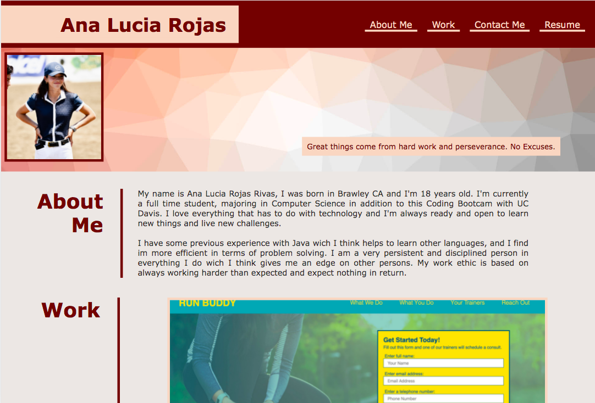
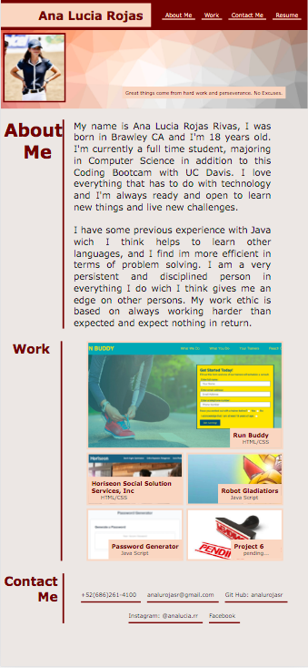

# Ana Lucia Rojas Professional Portfolio

## Table of Contents

* [Description](#description)
* [Code Snippets](#code)
* [Technologies](#technologies)
* [Preview](#preview)
* [Links](#links)

## Description

This project on creating a web page from scratch that functions as a professional portfolio. The idea is to showcase my skills and talents to employers with skills I've recently learned like flexbox, media queries, and CSS variables. 

## Code Snippets

* **Media Querie**
```            
@media only screen and (max-width: 1200px) {
    .about-me .title h2, .work .title h2, .contact-me .title h2 {
        font-size: 40px;
    }
}
```  

* **CSS Variables**
```            
:root {
    --red: rgb(107, 1, 1);
    --text: white; 
    --red2: rgb(245, 214, 196); 
    --grey: rgb(46, 45, 45);
  }
```  

* **Flex Properties**
```            
.header {
    background-color:var(--red);
    display: flex;
    justify-content: space-between;
    flex-wrap: wrap;
}
```  

## Technologies

* HTML
* CSS

## Preview

This is the view of my portfolio website in a computer view. 



This is the view of my portfolio website in a cell phone view. 



## Links

* [URL of the deployed application](https://analuciarojas.github.io/challenge2/)

* [URL of the GitHub repository](https://github.com/analuciarojas/challenge2)